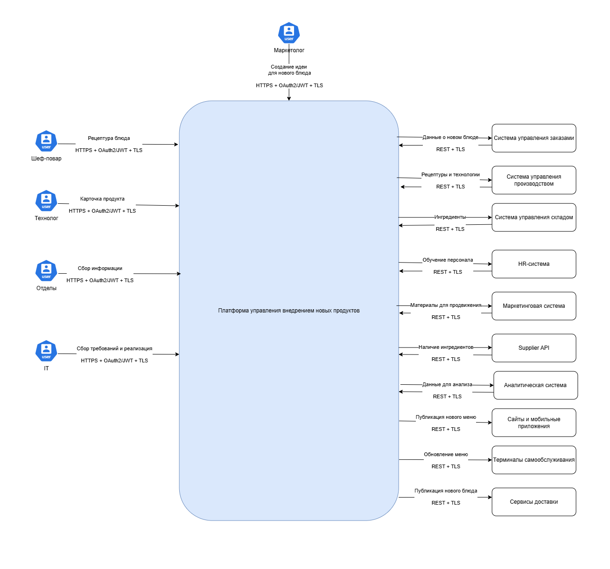
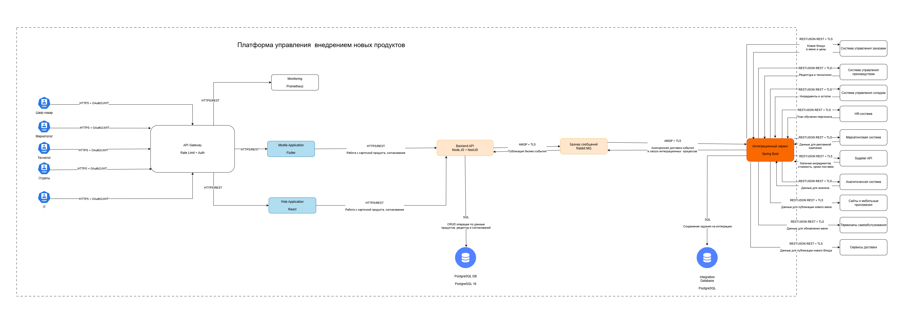
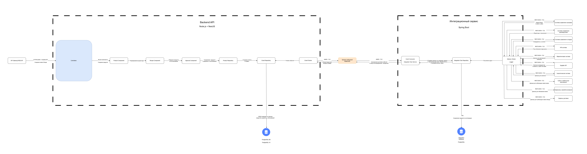

= Ускорение внедрения нового продукта в сети межконтинентальных закусочных «Замысловатость»
:toc: macro
:toclevels: 3
:toc-title: Оглавление

++++
++++

toc::[]

++++

++++

.История изменений
[options="header"]
|===
|Версия документа |Дата |Описание |Автор

|1.0 |27.08.2026 |Создан документ |Kharlamov Roman
|1.1 |01.09.2026 |Изменен документ |Kharlamov Roman
|1.2 |02.09.2026 |Добавлен раздел "MVP проекта и дальнейшее развитие продукта", скорректирована презентация MVP проекта и потоки в схемах архитектуры C1, C2, С3 |Kharlamov Roman
|===
== Термины и определения
.Термины и определения
[cols="1a,1a", options="header"]
|===
|Термин, аббревиатура |Определение, расшифровка
|IT/ИТ	|Информационные технологии, которые связаны с созданием, обработкой, хранением, передачей и защитой информации с помощью компьютеров, программного обеспечения, сетей и цифровых систем.
|HR	|Human Resources, «человеческие ресурсы» — это направление, связанное с управлением персоналом, а также специалисты, которые этим занимаются.
|Workflow	|Структурированная последовательность шагов, задач и действий, необходимых для достижения конкретного результата. 
|WIP-лимиты	|Work In Progress limits, инструмент управления рабочим процессом, который устанавливает ограничение на количество задач, которые могут одновременно находиться в работе на определённом этапе.
|Lead Time	|Метрика, которая измеряет общее время от момента, когда задача или запрос возникла, и до момента её полного завершения и доставки заказчику.
|Cycle Time	|Метрика, которая показывает, сколько времени команда фактически тратит на активную работу над задачей: от момента, когда она официально перешла в статус «В работе», до полного завершения (перехода в статус «Готово»).
|Throughput	|Пропускная способность. Метрика, которая показывает объём выполненной работы за определённый период времени.
|Blocked Time |Метрика, которая измеряет время, в течение которого задача была «заблокирована», то есть команда не могла продвигать её дальше из-за внешних или внутренних зависимостей.
|SLA |Service Level Agreement, договор между тем, кто услугу оказывает, и тем, кто её получает: в нём чётко прописывают, какого качества сервис ожидается, в какие сроки и что будет, если эти условия нарушат.
|Change request |Формальный запрос на внесение изменений в проект, продукт, бизнес-процесс или систему.
|Definition of Ready |Набор критериев, которым должна соответствовать задача, чтобы её можно было взять в работу.
|Definition of Done |Набор критериев, которые показывают, что задача полностью завершена и готова к следующему этапу или использованию. 
|ROI |Return on Investment, показатель рентабельности инвестиций, который показывает, насколько выгодными оказались вложенные средства.
|MVP |Minimum Viable Product, базовая версия продукта с ограниченным набором функций, которая уже способна решить ключевую проблему пользователя и донести ценность вашей идеи. 
|DDD |Domain-Driven Design, подход к проектированию программного обеспечения, при котором архитектура системы строится вокруг бизнес-домена, а не вокруг технических деталей вроде баз данных или фреймворков.
|SOA |Service-Oriented Architecture, подход к проектированию программного обеспечения, при котором система строится из набора независимых компонентов, называемых сервисами. Каждый сервис выполняет конкретную бизнес-функцию и может взаимодействовать с другими сервисами через стандартизированные интерфейсы и протоколы. 
|EDA |Event-Driven Architecture, подход к проектированию программных систем, при котором взаимодействие между компонентами строится вокруг обмена событиями.
|ATAM-сессия |Architecture Tradeoff Analysis Method, cтруктурированная рабочая встреча, которая проводится для анализа архитектуры программного обеспечения. 
|ISO/IEC 27001 |Международный стандарт, который устанавливает требования к системе менеджмента информационной безопасности. 
|RTO |Recovery Time Objective, максимально допустимое время простоя системы после инцидента.
|RPO |Recovery Point Objective, максимально допустимый объём потери данных при аварии, выраженный во времени.
|Prometheus |Cистема мониторинга и оповещения с открытым исходным кодом.
|Frontend |Часть сайта, приложения или веб-сервиса, которую видит и с чем непосредственно взаимодействует пользователь.
|Backend |Внутренняя, скрытая от пользователя часть сайта, приложения или сервиса.
|API |Application Programming Interface, программный интерфейс, который позволяет разным приложениям, сервисам или программам взаимодействовать друг с другом и обмениваться данными.
|API Gateway |Инфраструктурный сервис, который выступает единой точкой входа для всех клиентских запросов в микросервисной архитектуре.
|HTTPS |HyperText Transfer Protocol Secure, защищённый протокол передачи данных между браузером пользователя и веб-сервером.
|TLS |Transport Layer Security, криптографический протокол, который обеспечивает безопасную передачу данных в сети. 
|OAuth 2.0 |Open Authorization 2.0, протокол авторизации, который позволяет одному приложению (клиенту) получить ограниченный доступ к данным пользователя на другом сервисе без передачи логина и пароля.
|RBAC |Role-Based Access Control, модель, которая помогает системно и безопасно распределять права доступа к ресурсам в IT-системах.
|REST |Архитектурный стиль (набор правил) для взаимодействия компонентов распределённого приложения в сети, чаще всего между клиентом и сервером.
|JSON |JavaScript Object Notation, текстовый формат для хранения и передачи структурированных данных.
|JWT |JSON Web Token, открытый стандарт (RFC 7519), который позволяет безопасно передавать данные между клиентом и сервером в виде компактного JSON-объекта.
|AMQP |Advanced Message Queuing Protocol, открытый стандарт прикладного уровня для асинхронного обмена сообщениями между компонентами распределённой системы.
|Transactional Outbox |Архитектурный подход, который помогает надёжно передавать события между сервисами в распределённых системах (например, в микросервисной архитектуре), избегая потери данных и обеспечивая согласованность.
|DLQ |Dead Letter Queue, специальная очередь (или отдельный топик в системах потоковой обработки), куда система помещает сообщения, которые не удалось успешно обработать потребителями.
|Retry |Паттерн в программировании и IT-инфраструктуре, который позволяет автоматически повторить выполнение операции (например, сетевого запроса к API) в случае неудачи. 
|PostgreSQL |Объектно-реляционная система управления базами данных (ОРСУБД) с открытым исходным кодом. 
|RabbitMQ |Брокер сообщений.
|Worker |механизм, который позволяет запускать JavaScript-код в отдельном фоновом потоке, чтобы тяжёлые вычисления, обработка больших данных или другие ресурсоёмкие задачи не блокировали основной поток и не «замораживали» пользовательский интерфейс (UI).
|Supplier API |Программный интерфейс (API), который позволяет автоматизировать взаимодействие с поставщиками: получать, создавать, обновлять и удалять данные о них.
|===

== Общие сведения
Платформа управления внедрением новых продуктов является новой информационной системой сети межконтинентальных закусочных «Замысловатость».

Система является центральной точкой управления жизненным циклом нового блюда — от появления идеи до согласования и передачи информации в системы, обеспечивающие производство, склад, продажи, маркетинг и другие процессы.

Архитектура построена как набор взаимодействующих контейнеров и компонентов. Пользовательские приложения взаимодействуют с Платформой управления внедрением новых продуктов через API Gateway. Backend API отвечает за бизнес-логику, а Интеграционный сервис — за надежную асинхронную доставку данных во внешние системы.

.Общие сведения о системе
[cols="1a,1a", options="header"]
|===
|Параметр |Описание
|Название системы	|Платформа управления внедрением новых продуктов.
|Назначение системы	|Платформа управления внедрением новых продуктов — информационная система управления жизненным циклом нового продукта (блюда), которая предназначена для автоматизации процесса создания, разработки, согласования и внедрения нового блюда в сети межконтинентальных закусочных «Замысловатость».
|Используется системами	|Платформа управления внедрением новых продуктов используется следующими внешними системами и каналами:

* Веб приложение;
* Мобильное приложение;
* Система мониторинга (Prometheus);
* Cистема управления заказами;
* Cистема управления производством;
* Cистема управления складом;
* HR-система;
* Маркетинговая система;
* Supplier API;
* Аналитическая система;
* Сайты и мобильные приложения сети;
* Терминалы самообслуживания сети;
* Сервисы доставки.
|Использует системы	|Платформа управления внедрением новых продуктов использует:

* RabbitMQ — брокер асинхронных сообщений;
* PostgreSQL (База данных) — основное хранилище Платформы управления внедрением новых продуктов;
* Интеграционная база данных — хранилище интеграционных задач;
* API Gateway — аутентификация, авторизация и управление внешними запросами;
* Внешние системы для взаимодействия через Интеграционный сервис:

** Cистема управления заказами;
** Cистема управления производством;
** Cистема управления складом;
** HR-система;
** Маркетинговая система;
** Supplier API — для получения информации о наличии ингредиентов;
** Аналитическая система;
** Сайты и мобильные приложения сети;
** Терминалы самообслуживания сети;
** Сервисы доставки.
|Статус	| 
* [*] В разработке
* [ ] На среде TEST
* [ ] На среде PREPROD
* [ ] На среде PROD
* [ ] Не используется.
|Команда проекта	|
* Бизнес-заказчик;
* Руководитель проекта;
* IT Lead;
* Архитектор системы;
* Системный аналитик;
* Backend-разработчик;
* Frontend-разработчик; 
* DevOps-инженер;
* Представитель отдела по информационной безопасности;
* Инженер по тестированию;
* Представитель службы эксплуатации;
* Представитель пользователей.
|Backlog проекта	| 
https://roman17.atlassian.net/jira/software/projects/WORK/boards/1[Backlog проекта].
|Презентация MVP проекта	| 
link:Documentation/Prezentation/Проект_ускорения_внедрения_нового_продукта.pptx[Презентация MVP проекта].
|===

== Цель внедрения проекта 
Создание сервиса автоматизированного сбора требований и реализации микросервисной архитектуры, обеспечение интеграций с текущими решениями.

Основные цели:

* Сокращение времени создания и внедрения нового блюда;
* Автоматизация согласования нового блюда;
* Устранение ручного дублирования информации между системами;
* Централизованное хранение рецептур и карточек продуктов;
* Автоматизация публикации информации о новом блюде;
* Повышение надежности интеграции с корпоративными системами;
* Обеспечение аудита действий пользователей;
* Повышение безопасности и управляемости процесса разработки продукта.

== Описание проекта и основных решаемых задач
Основная задача проекта — создать единую систему управления процессом разработки нового блюда и сократить Lead Time c 30+ дней до 14-20 дней по внедрению нового блюда.

В существующем процессе информация о блюде может создаваться и изменяться разными подразделениями. При отсутствии единого информационного центра возникает риск дублирования данных, ошибок при передаче рецептуры и несогласованности информации между ИТ-системами.

Платформа управления внедрением новых продуктов решает эти проблемы путем создания единого жизненного цикла продукта.

Основные этапы:

Идея → создание нового блюда → рецептура → согласование → сохранение → публикация события → интеграция → обновление внешних систем.

== Roadmap проекта
image::Documentation/Images/Roadmap.png"[Roadmap проекта]

== Риски проекта
.Риски проекта
[options="header", cols="4,2,2,2,3"]
|===
|Риск |Вероятность |Влияние |Уровень |Ответ

|Сопротивление новым правилам/системе |Средняя |Высокое |Высокий |Снижение

|Перегруз ключевых специалистов |Высокая |Высокое |Критический |Снижение

|IT-зависимости / интеграции |Средняя |Высокое |Высокий |Снижение

|Неготовность поставщика |Средняя |Среднее |Средний |Снижение/резерв

|Изменение требований после старта |Средняя |Высокое |Высокий |Контроль изменений

|Недостаточное тестирование |Низкая/средняя |Высокое |Высокий |Снижение

|Срыв обучения/операционной готовности |Средняя |Среднее |Средний |Снижение

|Ошибки цены/фудкоста |Низкая/средняя |Высокое |Высокий |Двойная проверка
|===

== Описание архитектуры проекта

Архитектура Платформы управления внедрением новых продуктов разработана с учетом функциональных и нефункциональных требований.

Архитектура сочетает:

* DDD — для выделения предметных областей и компонентов;
* SOA — для взаимодействия с корпоративными системами;
* EDA — для асинхронного обмена событиями;
* Transactional Outbox — для гарантированной публикации событий.

=== Алгоритм работы системы
Шаг 1. Создание продукта

Маркетолог, технолог или шеф-повар создают или изменяют карточку блюда через Веб/Мобильное Приложение.

Шаг 2. Аутентификация

Запрос проходит через API Gateway, где выполняется проверка пользователя и его прав.

Шаг 3. Обработка входящих данных

Product Controller передает запрос компонентам Product и Recipe.

Шаг 4. Согласование продукта

Компонент Approval выполняет необходимые операции согласования.

Шаг 5. Сохранение данных продукта, рецептуры и согласования продукта

Product Repository сохраняет бизнес-данные в базу данных PostgreSQL (сущности Product, Recipe, Approval).

Шаг 6. Сохранение событий

Event Repository (Outbox) — сохраняет события в таблицу Outbox одновременно с бизнес-данными в рамках одной транзакции.

В рамках транзакции создается событие в таблице Outbox.

Например: ProductCreated, ProductApproved, RecipeUpdated

Шаг 7. Публикация событий

Event Worker получает неотправленные события и публикует их в RabbitMQ.

Шаг 8. Прием данных интеграционным сервисом

Event Consumer получает сообщение из RabbitMQ и сохраняет интеграционную задачу в Интеграционную базу данных.

Шаг 9. Получение задач для отправки во внешние системы

Delivery Worker получает необработанные задачи и независимо отправляет информацию в необходимые внешние системы.

Шаг 10. Обработка ошибок

Если в одной из систем произошла ошибка, то Интеграционный сервис фиксирует ошибку, добавляет запись в журнал логирования, повторяет отправку (ретраи 10 сек., 30 сек., 2 мин., 10 мин. После исчерпания попыток сообщение отправляется в техническую поддержку сервиса и ответственным. При этом пользователю отображется ответ успешного создания нового блюда от Backend API после сохранения данных в БД.)

После превышения допустимого количества попыток задача может быть направлена в DLQ.

=== Архитектурная схема проекта

link:Documentation/Diagrams/Architecture.drawio[Архитектурная схема (C1,C2,C3)]

C1:

C2:

C3:

==== Описание интеграционных потоков Платформы управления внедрением новых продуктов с внешними системами:

1. Поток Платформа управления внедрением новых продуктов -> Система управления заказами.
Требуется для автоматической передачи сведений о продукте в систему управления заказами после утверждения нового блюда. Благодаря этому новое блюдо становится доступным для оформления заказов во всех ресторанах сети и во внутренних системах обработки заказов.

2. Система управления заказами → Платформа управления внедрением новых продуктов.
Требуется для передачи в платформу результата обработки данных о новом продукте: статуса готовности продукта к приёму заказов, доступности для оформления заказов и возможных ограничений. Полученная информация используется для контроля готовности системы заказов к запуску блюда и отображения соответствующего статуса в карточке продукта.

3. Поток Платформа управления внедрением новых продуктов -> Система управления производством.
Требуется для передачи данных по утвержденной рецептуре, технологическим картам, нормам приготовления и требованиям к процессу производства. Это обеспечивает единый стандарт приготовления блюда во всех ресторанах сети.

4. Система управления производством → Платформа управления внедрением новых продуктов.
Требуется для передачи подтверждения готовности производства к выпуску нового блюда, а также замечаний и ограничений по рецептуре, технологической карте и процессу приготовления. Полученные данные позволяют ответственным сотрудникам своевременно устранить выявленные проблемы и зафиксировать результат производственной подготовки в карточке продукта.

5. Поток Платформа управления внедрением новых продуктов -> Система управления складом.
Требуется для передачи данных по необходимым ингредиентам, их количеству и требованиям к хранению.
На основании этих данных склад планирует закупки, резервирует остатки и контролирует наличие продукции для запуска нового блюда.

6. Система управления складом → Платформа управления внедрением новых продуктов.
Требуется для передачи информации о наличии необходимых ингредиентов, возможности их закупки, текущих остатках, сроках поставки и выявленных ограничениях. Эти данные используются для оценки готовности ресурсного обеспечения нового блюда и принятия решения о возможности его запуска.

7. Поток Платформа управления внедрением новых продуктов -> HR-система.
Требуется для передачи данных по программе обучения поваров, кассиров и другого персонала перед запуском нового продукта.

8. HR-система → Платформа управления внедрением новых продуктов.
Требуется для передачи статуса подготовки и проведения обучения персонала, необходимого для запуска нового продукта. HR-система возвращает информацию о готовности программы обучения, назначенных мероприятиях и возможных проблемах. Эти сведения позволяют учитывать готовность персонала при согласовании запуска блюда.

9. Поток Платформа управления внедрением новых продуктов -> Маркетинговая система.
Требуется для передачи данных для описания продукта, изображений, рекламных материалов, стоимость и дату запуска в маркетинговую систему. Эти данные используются при подготовке рекламных кампаний и продвижении нового блюда.

10. Маркетинговая система → Платформа управления внедрением новых продуктов.
Требуется для передачи результатов подготовки маркетинговых материалов и подтверждения готовности маркетинговой кампании. В платформу могут возвращаться статус подготовки описания, изображений и рекламных материалов, а также замечания или дополнительные требования маркетингового подразделения.

11. Поток Платформа управления внедрением новых продуктов -> Supplier API.
Требуется для взаимодействия с информационными системами поставщиков через API. Система получает сведения о наличии необходимых ингредиентов, сроках поставки, стоимости сырья и возможных заменах, а также может направлять поставщикам информацию о планируемой потребности. Это взаимодействие позволяет своевременно обеспечить рестораны необходимыми продуктами и избежать задержек при запуске нового блюда.

12. Supplier API → Платформа управления внедрением новых продуктов.
Требуется для получения от поставщиков актуальной информации о наличии ингредиентов, стоимости сырья, сроках поставки и возможных вариантах замены продуктов. Эти сведения используются при кросс-функциональной подготовке нового блюда для оценки возможности его запуска и своевременного выявления проблем с обеспечением необходимыми ингредиентами.

13. Поток Платформа управления внедрением новых продуктов -> Аналитическая система.
Требуется для передачи данных о новом продукте для расчета прогнозируемого спроса, анализа экономической эффективности, оценки прибыльности и последующего контроля результатов запуска блюда.

14. Аналитическая система → Платформа управления внедрением новых продуктов.
Требуется для передачи результатов анализа нового продукта: прогнозируемого спроса, экономических показателей, ожидаемой эффективности и последующих фактических результатов запуска. Эти данные используются для принятия решений при согласовании продукта и последующей оценки успешности его внедрения.

15. Поток Платформа управления внедрением новых продуктов -> Сайты и мобильные приложения.
Требуется для передачи данных для автоматического обновления электронного меню на сайте компании и в мобильном приложении. Пользователи получают доступ к информации о новом блюде, его стоимости, составу и могут оформить заказ онлайн сразу после запуска продукта.

16. Поток Платформа управления внедрением новых продуктов -> Терминалы самообслуживания.
Требуется для передачи данных о новом блюде на терминалы самообслуживания, установленные в ресторанах. Благодаря этому посетители видят актуальное меню и могут заказать новый продукт без участия кассира.

17. Поток Платформа управления внедрением новых продуктов -> Сервисы доставки.
Требуется для синхронизации данных с внешними сервисами доставки, передавая описание блюда, стоимость, изображения и доступность продукта. Это позволяет одновременно запустить новое блюдо как в ресторанах, так и на платформах доставки.

=== Нефункциональные требования
.Нефункциональные требования
[cols="1a,1a", options="header"]
|===
|Тип требования |Описание
|Безопасность	|Обеспечивается на основе ISO/IEC 27001 с использованием OAuth 2.0, JWT, RBAC, TLS, аудита и защищенного хранения данных.

Защищаемые объекты:

* карточки продуктов;
* рецептуры;
* технологические карты;
* данные о составе ингредиентов;
* результаты согласований;
* требования к продукту;
* учетные записи пользователей;
* роли и права доступа;
* события Outbox;
* интеграционные задачи;
* журналы аудита;
* токены аутентификации;
* конфигурационные данные;
* интеграционные ключи.

Особое внимание уделяется рецептурам и технологическим картам, поскольку они являются значимой бизнес-информацией сети.
|Производительность	|Обеспечивается асинхронным обменом через RabbitMQ, фоновой обработкой и горизонтальным масштабированием.

Пиковая нагрузка:

* Количество одновременных пользователей - До 30
* Среднее количество REST-запросов - до 5 RPS
* Количество REST-запросов при пиковой нагрузке - до 20 RPS
* Количество событий RabbitMQ до 1000 сообщений/мин
* Среднее время ответа API: ≤ 500 мс
* Время публикации события: ≤ 2 сек.
|Доступность	|Обеспечивается кластеризацией инфраструктуры, резервированием БД и независимой работой Worker.

Целевой показатель доступности: 99,9 % в месяц.

Время доступности: 24x7*365.

Система предусматривает:

* горизонтальное масштабирование Backend API;
* отказоустойчивый RabbitMQ;
* резервирование PostgreSQL;
* независимую работу Worker;
* повторную доставку сообщений;
* мониторинг состояния компонентов.
|Надежность	|Достигается за счет Transactional Outbox, Retry и Dead Letter Queue.
|Целостность данных	|Обеспечивается транзакционным сохранением бизнес-данных и событий.
|Масштабируемость	|Обеспечивается возможностью независимо масштабировать Backend API, Интеграционный сервис и Worker.
|Совместимость	|Обеспечивается использованием REST, HTTPS, JSON и AMQP — стандартных протоколов взаимодействия.

Поддерживаются приложения

Веб-браузеры:

* Chrome
* Edge
* Firefox
* Safari

Мобильные ОС:

* Android 11+
* iOS 16+.
|Наблюдаемость	|Обеспечивается централизованным логированием и мониторингом (Prometheus).

Фиксируются:

* входящие запросы;
* идентификатор пользователя;
* операции создания и изменения продукта;
* изменения рецептуры;
* согласование;
* публикация событий;
* получение событий;
* попытки доставки;
* ошибки;
* результаты интеграционных операций;
* события безопасности.

Для корреляции операций используется Correlation ID, позволяющий проследить один бизнес-запрос через несколько компонентов.
|Класс восстановления	|Платформа управления внедрением новых продуктов классифицируется как критичность класса 2 — важная корпоративная система, поскольку временная недоступность Платформы управления внедрением новых продуктов не должна останавливать уже работающее производство и продажи, но препятствует запуску и обновлению новых продуктов.

* RTO = 1 час — система должна быть восстановлена не позднее чем через час после серьезного отказа.
* RPO = 15 минут — допустимая потеря последних изменений при аварийном восстановлении не должна превышать 15 минут.
|===

Таким образом, архитектура не только реализует бизнес-функциональность создания нового продукта, но и учитывает ключевые НФТ, выявленные при архитектурном анализе и ATAM-сессии.

== MVP проекта и дальнейшее развитие продукта
.MVP проекта и дальнейшее развитие продукта
[cols="1a,1a", options="header"]
|===
|Реализация MVP |Описание
|Цель пилота	|MVP проекта — реализация нового процесса внедрения нового блюда в сеть межконтинентальных закусочных «Замысловатость» на базе методологии Kanban, единого dashboard и минимальной автоматизации.
|Критерии успешности	|В рамках MVP реализованы и внедрены:

* Kanban-доска;
* единая электронная карточка продукта;
* единый шаблон требований;
* WIP-лимиты;
* единый workflow между подразделениями;
* автоматические уведомления.

Успешное проведение пилота. Новый процесс позволяет сократить срок внедрения нового блюда в сеть межконтинентальных закусочных «Замысловатость» до 14–20 рабочих дней.
|Решение в случае успешного завершения	|Внедрение микросервисной архитектуры и построение полноценной интеграционной платформы с отдельными микросервисами, двумя новыми БД PostgreSQL, брокером сообщений RabbitMQ, архитектурным подходом Transactional Outbox, специальной очередью для потоковой обработки DLQ, интеграцией со всеми внешними системами, которое позволяет масштабировать процесс на всю сеть.
|Решение в случае неуспешного завершения	|Не выполняется построение полноценной интеграционной платформы.
Анализ причин отклонения: где возникли очереди, какие WIP-лимиты не сработали, какие этапы дали наибольший Cycle Time и где возникли доработки. После этого корректируем процесс и проводим повторный пилот с ограниченным объёмом изменений.
|===

== Заключение

В результате спроектирована Платформа управления внедрением новых продуктов, предназначенная для управления жизненным циклом нового продукта сети межконтинентальных закусочных «Замысловатость».

Система объединяет пользователей, участвующих в создании и внедрении нового блюда, и существующие корпоративные ИТ-системы.

Ключевым архитектурным решением является переход от прямого синхронного взаимодействия к событийно-ориентированной архитектуре с использованием RabbitMQ. Основная бизнес-логика реализуется в Backend API, а взаимодействие с внешними системами вынесено в Интеграционный сервис. Для предотвращения потери событий применен Transactional Outbox, а для надежной доставки во внешние системы — Delivery Worker, Retry и Dead Letter Queue.

Безопасность системы организована с учетом ISO/IEC 27001: реализованы управление доступом, аутентификация, авторизация, защита каналов передачи, аудит, журналирование и механизмы обеспечения целостности данных.

В результате получена масштабируемая, отказоустойчивая и защищенная система, способная интегрироваться с существующей ИТ-инфраструктурой сети закусочных и поддерживать дальнейшее развитие.
